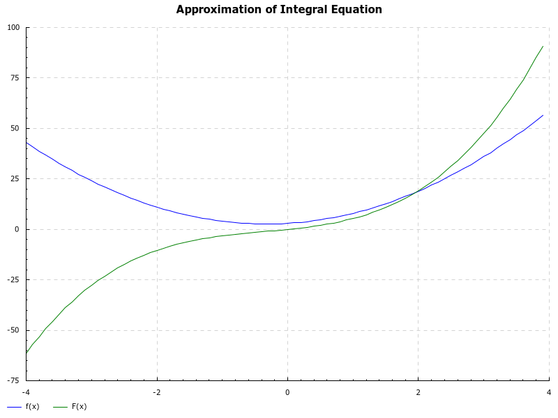

# Dylan's Haskell Integrator - dhi

## Description

A library for taking a function, finding approximations for the integral, and using various regression forms to recreate the indefinite integral

i.e. Take f, and get g = int(f, a, b) over and over again until we can find h = int(f)

Example:

## Running

`stack build`

`stack exec dhi`
